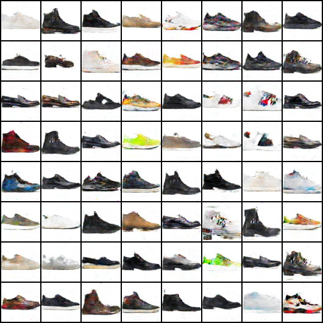
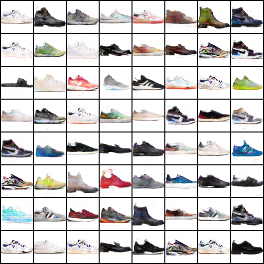

# Sneaker GAN

  

Since I collected a bunch of sneaker images, I thought it would be interesting to train a GAN model to generate unique sneaker silhouettes. In particular, I wanted to see what were the distinguishing features between cheaper (<$500) and more expensive (>$500) shoes. Here's what the images converged to after 220 epochs:

&nbsp;

 
Within the cheaper category, we see more silhouettes associates with general athletic shoes, ranging from runners to skate shoes to basketball sneakers. Furthermore, Nike and Adidas dominate a large portion of shoes in this category as the GAN was able to pick on on the Nike swoosh and the Adidas three stripes. Lastly, shoes within this category appear to be more colorful.

The most obvious feature of the expensive category seems to be the use of leather, as the majority of the shoes seem to be either dress shoes or leather boots. Colors are also more muted and neutral consisting mostly of black, white and beige. It's interesting to note that the two white sneakers on the 3rd row resemble the popular Gucci sneaker silhouette.
