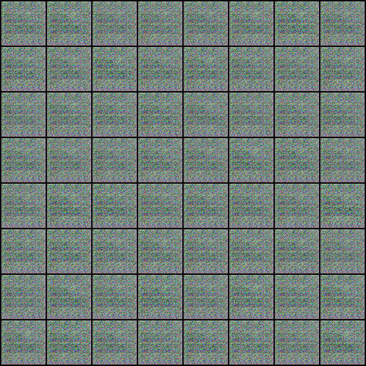

# Sneaker GAN

  

Since I collected a bunch of sneaker images, I thought it would be interesting to train a GAN model to generate unique sneaker silhouettes. In particular, I wanted to see what were the distinguishing features between cheaper (<$500) and more expensive (>$500) shoes. Here's what the images converged to after 220 epochs:
